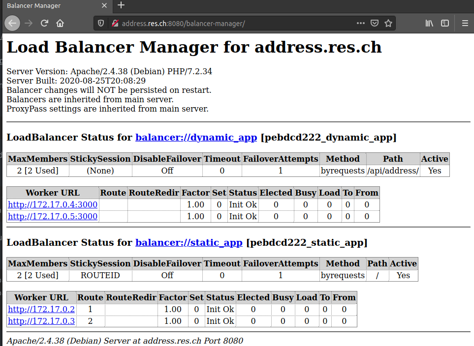

# Labo - Web Infrastructure

Auteurs : Basset Nils & Da Rocha Carvalho Bruno

## Description du projet 

Tous le projet a été monté dans l'optique de nous familiariser avec docker, et d'également être capable de monter une infrastrucutre web avec une partie statique, une partie dynamique ainsi qu'un proxy pour jouer le rôle d'intermédiaire en se plaçant entre deux hôtes.

### Infrastrucutre

Dans `docker-images` on retrouve toutes les images que nous avons créer, ainsi que les configuration de container.

#### Site statique

Dans les répertoires `./docker-images/apache-php-image` et `./docker-images/apache-php-image_bis` qui sont deux image d'un site statique identique à l'exception d'une petite variante dans un titre de la page du site statique pour pouvoir les différencier.

Nous avons donc choisi un template bootstrap : `Arsha Bootstrap Template` pour éviter de devoir coder et surtout d'avoir simplement une page agréable aux yeux.
Nous avons juste simplifier la page pour en alléger le contenu.

Pour lancer ces sites statique nous utilisons un container `php:7.2-apache`, pour le configurer nous utilisons un Dockerfile dans le contenus est le suivant : 

```dockerfile
FROM php:7.2-apache 
COPY src/ /var/www/html/ 
```

Où :

- FROM : Instruction utilisée pour spécifier le nom de l'image docker et start le processus

- COPY : Instruction utilisée pour copier un fichier ou un répertoire de notre hôte vers l'image Docker. Copie l'élément dans le context d'instruction de docker

Nous avons également ajouter un script jQuerry pour qu'une partie de notre site statique puisse ce faire mettre à jour automatiquement par notre application dynamique.
Le script jQuerry se trouve `/docker-images/apache-php-image/src/assets/js/address.js` dont voici le contenu

```javascript
$(function() {
    
    function loadAddress() {
        $.getJSON( "/api/address/", function( address ) {
            var message = address[0].adress + " " + address[0].city + " " + address[0].country;
            $(".hereToModify").text(message);
        });    
    };
    
    loadAddress();
    setInterval( loadAddress, 2000 );

});
```

On remarque que la fin de la fonction loadAddress() on viens écrire le "message" à un "flag" hereToModify. Ce flag correspond enfaite à la class d'une balise span englobant une partie de notre page html :

```html
<h2><span class="hereToModify">We are team of talented designers making websites with Bootstrap</span></h2>
```

**Pour les tester en indépendant**

- Construire l'image du container avec `docker build -t nom_a_choix docker-images/apache-php-image/` 
- Lancer le conatiner avec  `docker run -d nom_a_choix` (si pas sur linux -> `docker run -d -p 8080:80 nom_a_choix`)
- Pour y accèder depuis un navigateur vous pouvez contrôler l'adresse ip avec :  `docker inspect nom_a_choix | grep -i ipaddr`
- Accèder au site avec l'ip trouvée tel  `http://172.17.0.1:8080` 
- Pour terminer l'exécution du container, utiliser la commande `docker kill NAMES`. `NAMES`se trouve avec la commande `docker ps`.

#### Application dynamique (Javascript)

Dans le répertoire `./docker-images/express-image/` les fichiers pour l'image de notre application dynamique

Dont voici le script dans `src/`

```javascript
var Chance = require('chance');
var chance = new Chance();

var express = require('express');
var app = express();

app.get('/', function(req, res) {
    res.send( generateAddr() );
});

app.listen(3000, function() {
    console.log("Accepte des requête HTTP sur le port 3000");
});

function generateAddr() {
    var numberOfAdresse = chance.integer({
        min: 1,
        max: 10
    });
    console.log(numberOfAdresse);

    var adresses = [];
    
    for (var i = 0; i < numberOfAdresse; ++i) {

        adresses.push({
            adress: chance.address(),
            city: chance.city(),
            country: chance.country()       
        });
    };
    console.log(adresses);
    return adresses;
}
```

Ainsi que le Dockerfile pour la création de l'image : 

```dockerfile
FROM node:15.13.0
COPY src/ /opt/app
CMD ["node", "/opt/app/index.js"]
```

Où : 

- CMD : instruction pour exécuter une commande dans le container en running. Exécute la commande quand l'image docker est déployée.
- FROM : Instruction utilisée pour spécifier le nom de l'image docker et start le processus

- COPY : Instruction utilisée pour copier un fichier ou un répertoire de notre hôte vers l'image Docker. Copie l'élément dans le context d'instruction de docker

**Il faudra construire les dépendances node avec la commande `npm install` depuis le répertoire `./docker-images/express-image/src`. (si on n'a pas la commande npm -> `https://www.npmjs.com/`)**

**Pour la tester en indépendant**

- Construire l'image du container avec `docker build -t nom_a_choix docker-images/express-image/` 
- Lancer le conatiner avec  `docker run -d -p 9091:3000 nom_a_choix` 
- Pour y accèder depuis un navigateur vous pouvez contrôler l'adresse ip avec :  `docker inspect nom_a_choix | grep -i ipaddr`
- Accèder au site avec l'ip trouvée tel  `http://172.17.0.1:9091` 
- Pour terminer l'exécution du container, utiliser la commande `docker kill NAMES`. `NAMES`se trouve avec la commande `docker ps`.

#### Proxy

L'image du proxy ce trouve dans le répertoire `/docker-images/apache-reverse-proxy`.

Ce proxy est dynamique, c'est à dire que les adresses ip ne sont pas hardcodé dans les fichiers de configuration mais sont passé en paramètres lors du lancement des containers (on en parlera après). Cela grâce à une configuration dynamique du reverse proxy.

Cette configuration dynamique est permise grâce à deux fichiers, le premier étant un script php que nous utilisons pour lire les variables d'envrionnement contenant les adresses ip que l'on souhaite. Et le second fichier étant une "surcharge" du fichier apache2-foreground afin de pouvoir utiliser la génération de notre script php pour remplacer la config précédemment faîtes.

Nous avons mis en place également du load balancing avec des sticky session par id de route. C'est à dire que notre proxy gère équitablement les charges entres deux sites statiques mais garde les utilisateurs connecté aux même serveurs à chaque refresh grâce aux cookie.

Nous avons également une gestion de cluster dynamique.

Voici le script php configurant le gros de notre reverse proxy. Ce script ce trouve dans le répertoire `/docker-images/apache-reverse-proxy/templates/`

```php
<?php
    $static_app_01 = getenv('STATIC_APP_01');
    $static_app_02 = getenv('STATIC_APP_02');
    $dynamic_app_01 = getenv('DYNAMIC_APP_01');
    $dynamic_app_02 = getenv('DYNAMIC_APP_02');
?>

<VirtualHost *:80>
    ServerName address.res.ch
    
    Header add Set-Cookie "ROUTEID=.%{BALANCER_WORKER_ROUTE}e; path=/" env=BALANCER_ROUTE_CHANGED

    <Proxy balancer://dynamic_app>
        BalancerMember 'http://<?php print "$dynamic_app_01"?>'
        BalancerMember 'http://<?php print "$dynamic_app_02"?>'
    </Proxy>

    <Proxy balancer://static_app>
        BalancerMember 'http://<?php print "$static_app_01"?>' route=1
        BalancerMember 'http://<?php print "$static_app_02"?>' route=2
        ProxySet stickysession=ROUTEID
    </Proxy>

    <Location "/balancer-manager/">
        SetHandler balancer-manager
    </Location>
    
    ProxyPass '/balancer-manager/' !    

    ProxyPass '/api/address/' 'balancer://dynamic_app/'
    ProxyPassReverse '/api/address/' 'balancer://dynamic_app/'

    ProxyPass '/' 'balancer://static_app/'
    ProxyPassReverse '/' 'balancer://static_app/'
</VirtualHost>
```

Donc ici est le script php discuté précédemment dans lequel on retrouve;

- dans les lignes 2 à 5 : le script php qui get les varaibles d'envrionnement contenant les adresses ip.
- dans les lignes 13 à 22 : les balises proxy qui permettent de mettre un balancer entre les deux ip fournie pour nos deux sites statiques et nos deux api.
- ligne 21 qui permet d'activer la sticky session par id de route (les id de route défini juste en dessu uniquement pour les deux sites statique).
- ligne 11 permet de set un cookie qui contiendra les routes id.
- ligne 24 a 28 permette l'activation du cluster dynamique

*sources : https://stackoverflow.com/questions/28663033/how-can-i-set-up-a-load-balancer-for-multiple-virtual-hosts-apache/28664733 - http://docs.motechproject.org/en/latest/deployment/sticky_session_apache.html#method-1-using-existing-session-cookie - src: https://httpd.apache.org/docs/2.4/howto/reverse_proxy.html "Gestion du répartiteur de charge"*

Voici le fichier apache2-foreground, ce trouvant dans le répertoire racine de notre reverse proxy

```shell
#!/bin/bash
set -e

: "${APACHE_CONFDIR:=/etc/apache2}"
: "${APACHE_ENVVARS:=$APACHE_CONFDIR/envvars}"
if test -f "$APACHE_ENVVARS"; then
	. "$APACHE_ENVVARS"
fi

# Apache gets grumpy about PID files pre-existing
: "${APACHE_RUN_DIR:=/var/run/apache2}"
: "${APACHE_PID_FILE:=$APACHE_RUN_DIR/apache2.pid}"
rm -f "$APACHE_PID_FILE"

echo "Setup for the RES lab"
echo "Static App 01 URL: $STATIC_APP_01"
echo "Static App 02 URL: $STATIC_APP_02"
echo "Dynamic App 01 URL: $DYNAMIC_APP_01"
echo "Dynamic App 02 URL: $DYNAMIC_APP_02"

php /var/apache2/templates/config-template.php > /etc/apache2/sites-available/001-reverse-proxy.conf

rm -f /var/run/apache2/apache2.pid
exec apache2 -DFOREGROUND
```

Et enfin le Dockerfile de notre proxy : 

```dockerfile
FROM php:7.2-apache

RUN apt-get update && \
    apt-get install -y nano

COPY apache2-foreground /usr/local/bin/
COPY templates /var/apache2/templates
COPY conf/ /etc/apache2

RUN a2enmod proxy proxy_http proxy_balancer lbmethod_byrequests headers
RUN a2ensite 000-* 001-*
```

Pour lequel il est intéressant de s'arrêter sur la ligne 6 et 7 qui permettent de placer les deux fichiers précédemment discuté. Donc en soit de venir écraser le fichier apache2-foreground pour le remplacer par le notre, qui va exécuter le script php dans `/var/apache2/templates`.

Il est également intéressant de parler des deux lignes RUN;

- `RUN a2enmod` va nous permettre d'activer tout les modes précédement discuté pour que notre serveur apache soit au courant et active les fonctionnalité que l'on souhaite exploité
  - `proxy proxy_http` reverse proxy
  - `proxy_balancer lbmethod_byrequests` pour le load balancing
  - `header` pour les cookies des sticky session
- `RUN a2ensite` qui lui permet de spécifier qu'elle siteon souhaire activé, 000-* étant celui par défaut et 001-* celui qu'on configure avec le script php.

## Démonstration

**Avant toute chose** 
Il faut ajouter dans votre ficheir hosts une ligne contenant votre adresse ip suivi du nom de domaine que a donné pour le "ServerName" tel que : ` 192.168.1.123 address.res.ch`
Vous pouvez modifier votre fichier hosts en lançant depuis un terminal  `sudo !!`ou `sudo nano /etc/hosts`
Et si pas déjà fait il faudra construire les dépendances node avec la commande `npm install` depuis le répertoire `./docker-images/express-image/src`. (si on n'a pas la commande npm -> `https://www.npmjs.com/`)

1. S'assurer qu'aucun container portant un des noms suivant ne soit en cours d'exécution avec la commande `docker ps` : apache-static-1, apache-static-2, express-dynamic-1, express-dynamic-2.

   Et lancer la commande 

   ```shell
   docker rm `docker ps -qa`
   ```

2. Ensuite lancer la construction des containers des deux sites statiques et des applications dynamique avec le script fournis (lancer les script depuis la racine du projet)

   ```shell
   $ ./docker-images/apache-reverse-proxy/build.sh
   $ ./docker-images/apache-reverse-proxy/run.sh
   ```

3. Si nécessaire, par la on entends si d'autres containers occupe potentiellement des adresses IP. On vous conseil de vérifier les adresses ip avec : 

   ```shell
   $ docker inspect apache-static-1 | grep -i ipaddr
   $ docker inspect apache-static-2 | grep -i ipaddr
   $ docker inspect express-dynamic-1 | grep -i ipaddr
   $ docker inspect express-dynamic-2 | grep -i ipaddr
   ```

4. Et ensuite lancé le container du proxy avec le script fourni comme : 

   ```shell
   $ ./docker-images/apache-reverse-proxy/run_proxy.sh 172.17.0.2 172.17.0.3 172.17.0.4 172.17.0.5
   ```

5. On peut ouvrir un navigateur et se rendre à l'adresse `address.res.ch:8080`

   1. On voit dans un premier temps, que notre page change de contenus toutes les ~2 secondes
   2. Que si l'on refresh en boucle on ne quittera pas le site statique que l'on a atteint (soit le [1] soit le [2]) grâce a la sticky session.
   3. Si on vide notre cache et nos cookie et qu'on essaie de réatteindre notre site on peut être balancé soit sur le site statique [1] ou [2]. Donc notre load balancing fonctionne.

   


6. On peut ouvrir un nouvel onglet et se rendre à l'adresse `address.res.ch:8080/balancer-manager` on y retrouve bien notre gestionnaire de cluster dynamique.



## Gestion d'une interface utilisateur

Nous n'avons rien du mettre en place pour pouvoir avoir une interface web nous permettant d'avoir un visuel sur l'implémentation de container mis en place.

Pour pouvoir utiliser une interface utilisateur pour pouvoir gérer les containers plus facilement il faut comme précédement, si les containers sont toujours en cours d'exécution, les arrêter avec `docker kill` et lancer la commande :

```shell
docker rm `docker ps -qa`
```

Ensuite lancé la construction des containers et l'exécution des sites statiques et des applications dynamique avec les scripts fournis : 

```shell
$ ./docker-images/apache-reverse-proxy/build.sh
$ ./docker-images/apache-reverse-proxy/run.sh
```

Si nécessaire, par la on entends si d'autres containers occupe potentiellement des adresses IP. On vous conseil de vérifier les adresses ip avec : 

```shell
$ docker inspect apache-static-1 | grep -i ipaddr
$ docker inspect apache-static-2 | grep -i ipaddr
$ docker inspect express-dynamic-1 | grep -i ipaddr
$ docker inspect express-dynamic-2 | grep -i ipaddr
```

Et ensuite lancé avec le script fourni le proxy : 

```shell
$ ./docker-images/apache-reverse-proxy/run_proxy.sh 172.17.0.2 172.17.0.3 172.17.0.4 172.17.0.5
```

Pour enfin lancé la commande suivante : 

```shell
$ docker run -d -p 9000:9000 -v /var/run/docker.sock:/var/run/docker.sock portainer/portainer
```

Puis de ce connecter depuis un navigateur au site `localhost:9000`.

Cela vous ammène sur le portail portainer.io ou vous devrez vous créer un compte administrateur 


Une fois connectez, vous vous retrouverez sur une page pour choisir qu'elle environnement vous voulez administrer, sélectionnez "Local"


Sur le menu principal vous verez vos envrionnement à manager, normalement qu'un seul qui est celui en local. Vous pouvez cliquer dessus


Ensuite vous verez le résumé de l'envrionnement et ce qui le compose. Cliquer sur "Containers" pour pouvoir voir les containers.


Pour finalement arrivé sur l'écran de gestion des containers.


